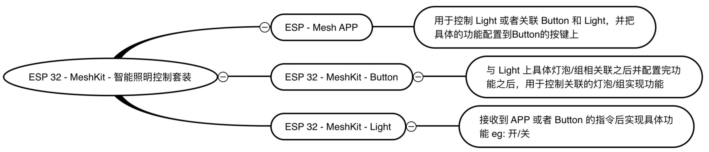
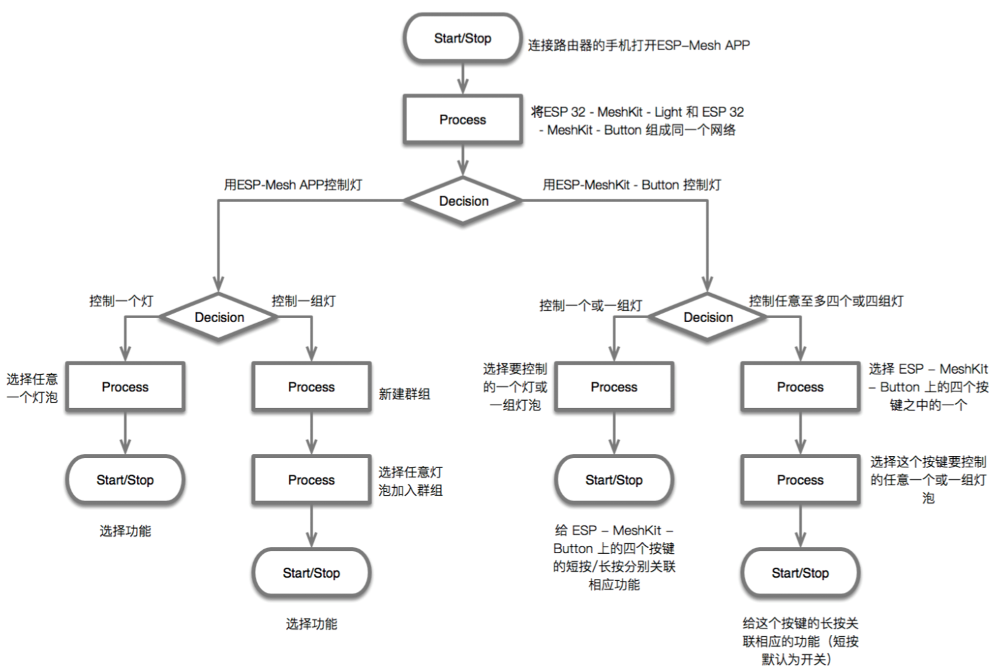

# mesh button 使用说明文档

## 概述

本示例为 ESP32-MeshKit-Button 的设备端代码，ESP32-MeshKit-Button 是基于 ESP Mesh 的智能开关，包含配网、升级和设备联动等功能，它将帮助您更好地了解 ESP-MESH 的在超低功耗的场景下使用。
ESP32-MeshKit-Button 仅作子节点连入 ESP-MESH，因此需要配合 ESP32-MeshKit-Light 使用。
在运行本示例之前请先详细阅读 [ESP32-MeshKit 指南](../README.md)

 模块设计 

## 硬件说明

* [ESP32-MeshKit-Button 开发板](docs/ESP32-MeshKit-Button_Schematic.pdf) 一个
* [ESP32-MeshKit-Light](https://www.espressif.com/zh-hans/support/download/documents?keys=&field_technology_tid%5B%5D=18) 一个或多个
* [ESP-Prog 调试器](https://github.com/espressif/esp-iot-solution/blob/master/documents/evaluation_boards/ESP-Prog_guide_cn.md)（调试用，非必须）
* 锂电池（可通过 Mini USB 供电，非必须）：200 mAh

 设备交互 

其中，ESP32-MeshKit-Button 开发板硬件资源主要包括：

* 主控单元：ESP32 SoC
* 供电单元：Mini USB 供电口和外接电池供电口
* 调试单元：ESP-Prog 调试器接口
* 控制单元：4 个按键
* 显示单元：4 个 RGB LED

## 功能简介
ESP-MeshKit-Button 上的按键有两种操作⽅式: 短按和⻓按。   在⽤ ESP-MeshKit-Button 对 ESP-MeshKit-Light 中的任意⼀个或⼀组灯泡进⾏控制实现丰富的功能时，短按用于调节灯的模式如： 开/关、情景模式或颜色切换的操作，长按⽤于灯的微调如：灯的亮度增减，冷暖增减。

 功能简介 

## 操作流程

在使用 ESP32-MeshKit-Button 之前，先启动 ESP32-MeshKit-Light，并完成配网组网。

 操作流程 

### 1. 配网

* 将 ESP32-MeshKit-Button 连接 Mini USB，LED 黄色闪烁，表明设备已进入配网状态。若设备需要重新配网，同时长按任意两个键将重置设备。
* 根据 [ESP32-MeshKit 指南](../README.md) 中相关配网操作流程，将是设备添加进网络。
* 配网完成后，ESP-MESH App 出现 Button 设备，LED 将停止闪烁，等待与 ESP32-MeshKit-Button 关联。

<table>
    <tr>
        <td >
加入网络
</td>
        <td >
配网成功
</td>
    </tr>
</table>

### 2. 关联
* 添加设备配⽹网成功后，打开ESP-Mesh App, 长按 Button 设备，在弹出的框中选择 `自动化` 选择关联的模式及设备， 为每一个按键绑定关联的事件，点击右上角的 `√` 完成关联。
* 关联完成后，设备端的 LED 将显示充电的状态

<table>
    <tr>
        <td >
选择关联的方式
</td>
        <td >
选择关联的设备
</td>
        <td >
绑定关联的事件
</td>
    </tr>
</table>

### 3. 控制
* ESP32-MeshKit-Button 若连接 Mini USB，当按键触发时处于 **ESP-MESH 模式**,在此模式下，可以对设备进行配网、绑定、升级和控制
* ESP32-MeshKit-Button 若未连接 Mini USB 使用电池供电时，处于 **ESP-NOW 模式**在此模式下，ESP32 芯片会断开电源，仅在按下按键时重新启动 ESP32 芯片，发送完控制指令后立即断开电源。

### 4. 指示灯的颜色：

* 未配网或正在组网： 黄色闪烁
* 未绑定： 黄色
* 按下按键：
    * 正常： 绿色
    * 异常： 黄色
* 正在充电： 蓝色闪烁
* 充电完成： 蓝色
* 电量不足： 红色闪烁

## 功耗及时间
ESP32-MeshKit-Button 是针对超低功耗按键方案，设备从断电到完成发包需要 1200ms 左右的时间，200 mAh 的电源可以支持 10000 次控制，下表列出了本示例在各个运行阶段的电流和时间，电流值为电源供电处 “DCVCC-SUFVCC” 的电流

| 运行阶段 | 电流 | 时间 |
|---|---|---|
| ESP32 芯片断电 | 0.1 uA | 使用电池供电，按键未触发时 |
| 唤醒后的启动过程 | 40 mA | 800 ms |
| 初始化及 ESP-NOW 发包控制 | 60 mA | 400 ms |

> 注 ：
> 1. 数据传输：由于从 ESP-MESH 子设备从启动到组网成功需要的时间大约 500ms 左右，因为当设备配置完成后，使用 ESP-NOW 进行数据的传输，由于 ESP-NOW 是基于数据链路层的无连接协议，因此省去设备连接的时间
> 2. 检测时间： 在 bootload 增加了按键检测，无需等到设备进入
> 3. bootload 启动时间： 清除 bootload 日志，减少 bootload 的启动时间